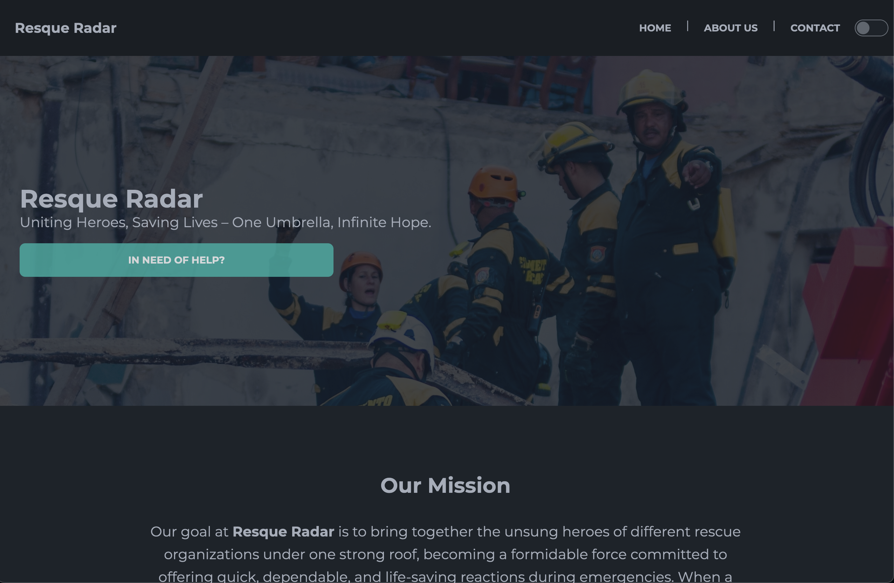
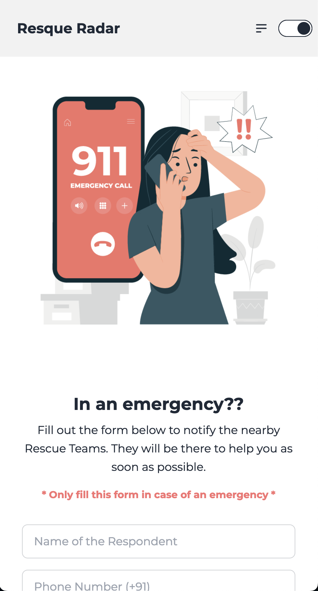

|  |  |
| :---: | :---: |

Resque Radar is a cutting-edge application designed to revolutionize disaster response and relief efforts. In the face of natural or man-made calamities, it serves as a centralized platform where all rescue agencies can register and collaborate seamlessly. This innovative digital solution empowers rescue and relief organizations to work cohesively during crises, ultimately saving lives and minimizing damage.

You can find the live site <a href="https://rescueradar.azurewebsites.net/" target="_blank">here</a>.