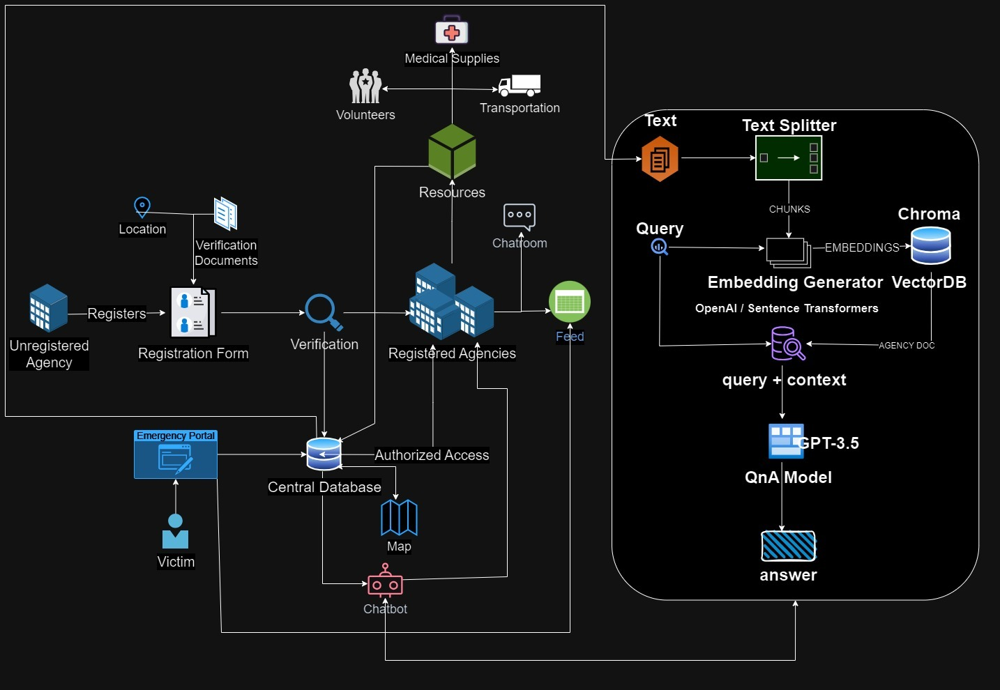

|  |  |
| :---: | :---: |

   

Resque Radar is a cutting-edge application designed to revolutionize disaster response and relief efforts. In the face of natural or man-made calamities, it serves as a centralized platform where all rescue agencies can register and collaborate seamlessly. This innovative digital solution empowers rescue and relief organizations to work cohesively during crises, ultimately saving lives and minimizing damage.

You can find the live site <a href="https://rescueradar.azurewebsites.net/" target="_blank">here</a>.

## Table of Contents

- [Table of Contents](#table-of-contents)
- [Installation](#installation)
- [Working](#working)
- [Contributors](#contributors)
- [License](#license)

## Installation

Follow the steps [here](docs/installation.md) to install the project locally on your machine.

## Working

## Contributors

This project was made for the [Smart India Hackathon 2023](https://www.sih.gov.in/) for the problem statement 1440. The team members are:

- [Abhisek Sahoo](https://github.com/abhisek-1221) - Team Lead
- [Rachit Khurana](https://github.com/notnotrachit) - Django Developer
- [Chirag Aggarwal](https://github.com/ChiragAgg5k) - Frontend Developer
- [Aviral](https://github.com/PlasmicZ) - UI Designer
- [Tanmay](https://github.com/JagritiGautam793) - Research and Documentation
- [Jagriti Gautum](https://github.com/TanmayChachra) - AI and ML

## License

This project is licensed under the MIT License - see the [LICENSE](/LICENSE.md) file for details.
